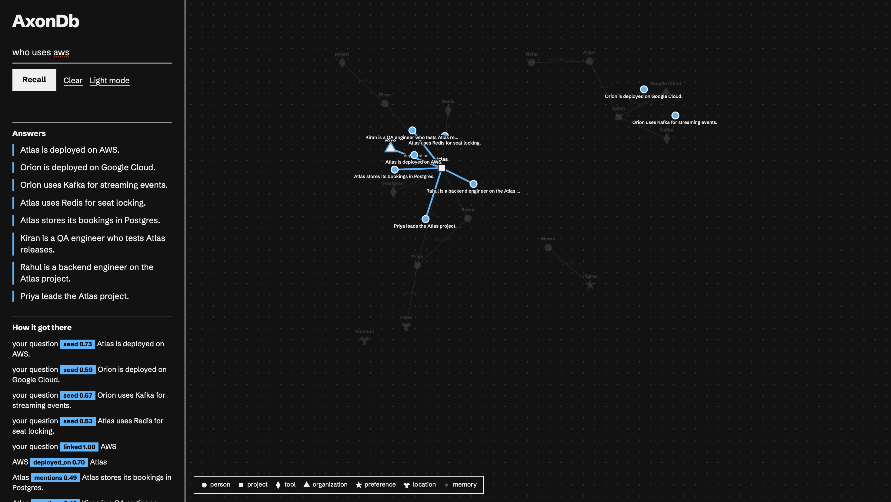
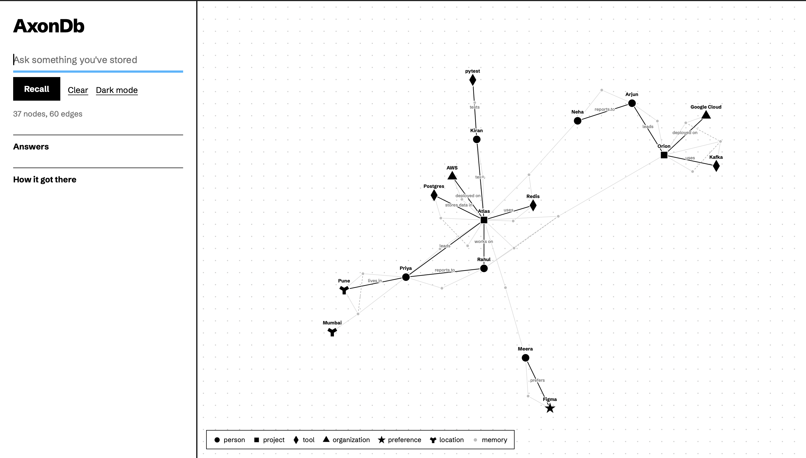

# AxonDb

Local graph memory for AI agents. Every answer comes with the path it followed.





AxonDb stores memories in SQLite, links the people, projects and tools they mention, and returns the relevant memories together with the path used to find them. Everything runs on your machine.

## Features

* Local SQLite storage. No account, no API key, no hosted service.
* Semantic search combined with graph traversal.
* Explainable recall: the traversed path is part of the result.
* Command line tool, MCP server and local web viewer.
* Forgetting never deletes. Memories are closed with an end timestamp.

## Benchmark

A generated set of 100 memories and 100 questions (`eval/make_big_set.py`). Every answer appears in exactly one memory, and a hit means the right sentence is among the top 3 or top 5 results. All methods use the same questions and the same embedding model. Questions are split by how many facts must be connected.

Questions answered (out of 100):

```
                        Top 3 results                 Top 5 results
                    Vector   BM25  AxonDb         Vector   BM25  AxonDb
All 100 questions       35     19      46             41     29      63
Percent                35%    19%     46%            41%    29%     63%
```

By number of hops:

```
                        Top 3 results                 Top 5 results
                    Vector   BM25  AxonDb         Vector   BM25  AxonDb
1 hop (25)              24     15      25             25     25      25
2 hop (45)               4      2      11              8      2      18
3 hop (30)               7      2      10              8      2      20
```

AxonDb gains most on questions that need two or three connected facts. One hop questions are a tie.

Caveats:

* The data is templated and clean. Expect smaller gaps on real conversations.
* 100 questions is a modest sample, and the data and the system share one author.
* A hybrid vector and keyword baseline was not tested.
* Two earlier hand written sets of 15 questions gave closer results. They are in the git history.
* Scores from other systems are not comparable.

Reproduce:

```
pip install rank_bm25
python eval/make_big_set.py
PYTHONPATH=src python eval/run_eval.py
```

Results are written to `eval/results_big.md`.

## Install

Requires Python 3. Developed on macOS with Python 3.14.

```
git clone https://github.com/yashogale30/AxonDb
cd AxonDb
python3 -m venv .venv
source .venv/bin/activate
pip install .
```

The first run downloads two small models from Hugging Face. After that they run locally.

## Quick start

Try the demo in a separate database:

```
AxonDb load demo/demo_memories.json --db demo.db
AxonDb recall "Which database does the project Kiran tests use?" --db demo.db
```

Use your own memory (default database: ~/.AxonDb/AxonDb.db):

```
AxonDb remember "Priya leads the Atlas project."
AxonDb remember "Atlas uses Redis for seat locking."
AxonDb recall "Which project does Priya lead?"
```

Write complete sentences with names, not pronouns, for the best entity linking. Other commands: `AxonDb list`, `AxonDb forget MEMORY_ID`, and `--limit N` on recall.

## Claude Desktop

Add this to `~/Library/Application Support/Claude/claude_desktop_config.json` with your own paths, then restart Claude Desktop:

```
{
  "mcpServers": {
    "axondb": {
      "command": "/FULL/PATH/TO/AxonDb/.venv/bin/python",
      "args": ["-m", "AxonDb.mcp_server"],
      "env": { "AXONDB_PATH": "/FULL/PATH/TO/memory.db" }
    }
  }
}
```

The server exposes three tools: remember, recall and forget.

## Viewer

```
AXONDB_PATH=/FULL/PATH/TO/memory.db python -m uvicorn AxonDb.api:app --port 8000
```

Open http://127.0.0.1:8000/. The viewer draws the graph and highlights the path of the latest recall.


## Architecture
```
AXONDB WORKFLOW

HOW A MEMORY IS STORED (remember)

  A sentence arrives from the CLI, the MCP server or the viewer API
        ▼
  1. Save the sentence as a memory node
        ▼
  2. Embed the sentence into a vector
     (BGE small English v1.5, runs locally)
        ▼
  3. Extract entities and relations
     (GLiNER2, runs locally)
        ▼
  4. Resolve entities
     reuse an existing node if the name matches
     or the name vector is very similar
        ▼
  5. Write to SQLite
     nodes: the memory, with its vector, and the entities
     edges: mentions, typed relations, similar_to


HOW A QUESTION IS ANSWERED (recall)

  A question arrives from the CLI, the MCP server or the viewer API
        ▼
  1. Embed the question
     (same BGE model, with its query prefix)
        ▼
  2. Find the starting points (seeds)
     a. the top 4 stored memories by vector similarity
     b. any stored entity whose name appears in the question
        ▼
  3. Hop through the graph
     follow edges from the seeds, up to 2 hops
     the score drops by a factor of 0.7 at each hop
        ▼
  4. Rank
     direct matches plus the memories reached by hopping
        ▼
  5. Return the memories and the path
     each path step: source, relation, destination, score


WAYS TO USE IT

  Claude Desktop → mcp_server.py ┐
  Terminal       → cli.py        ├→ memory.py and recall.py → store.py → SQLite file
  Browser viewer → api.py        ┘

```

## How it works

Remember: a sentence is embedded, entities and relations are extracted with a local model, matching entities are merged with existing ones, and memories are linked through shared entities and similarity.

Recall: the question is matched against stored memories and against entities it names. The search then spreads two hops along edges with a score that decays at each step, and returns the memories plus the path.

Settings are in `src/AxonDb/config.py`. All database access goes through one storage interface, so SQLite can be replaced later.

## Limitations

* No handling of changing facts: an old and a new fact can both be returned.
* Extraction errors carry into the graph.
* Graph expansion can add unrelated memories around heavily connected entities.
* Matching depends on wording. A question about a "cache" can miss a sentence that only says Redis.
* Questions that refer to people by role are a weak spot.

## Privacy

Memories stay in a local SQLite file. AxonDb sends nothing to a hosted service. If your agent uses a hosted model, recalled snippets are sent to that model by the agent. To remove everything, delete the database file.

## Development

```
pip install pytest
python -m pytest
```

## License

MIT